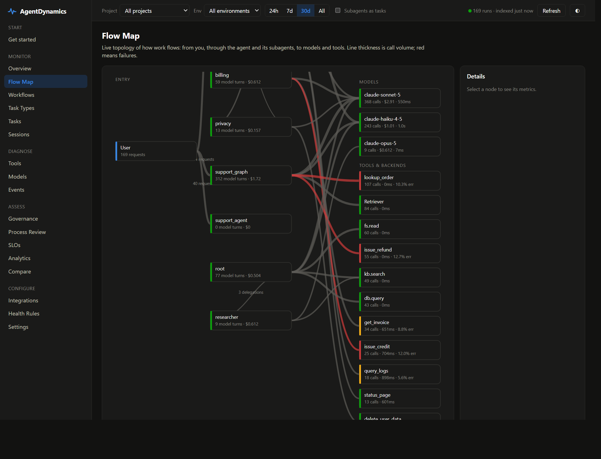
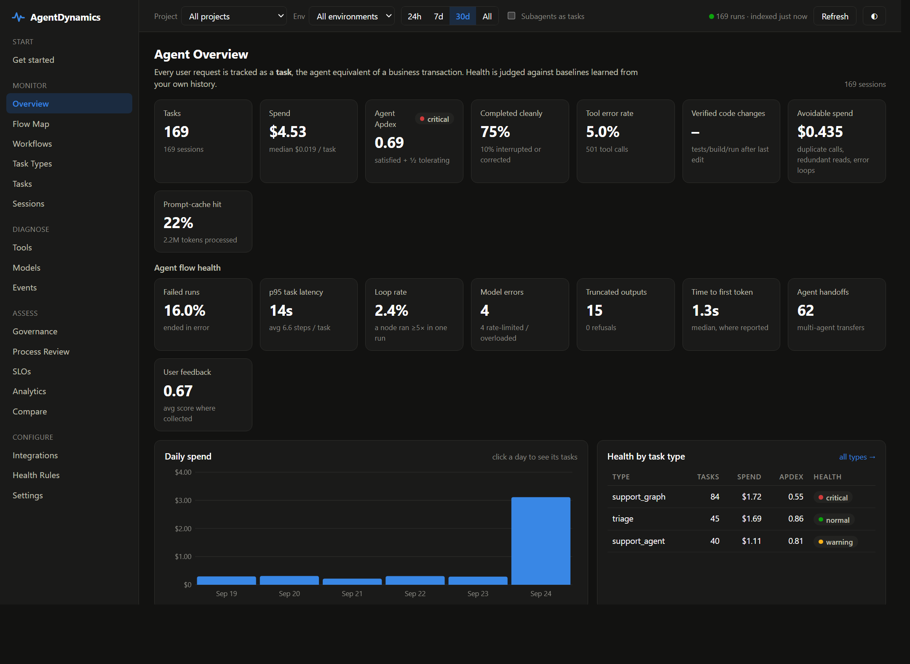
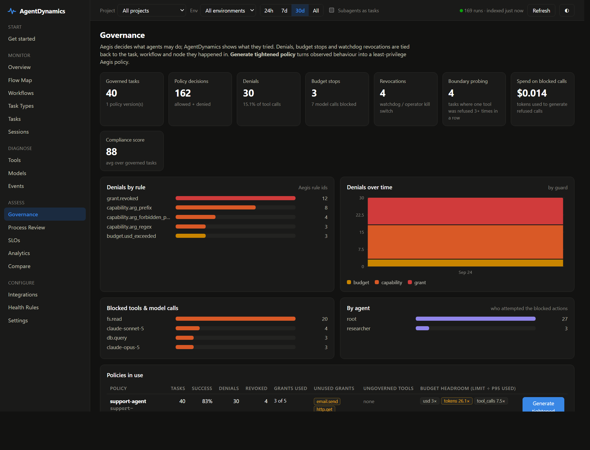

# AgentDynamics

[](https://github.com/Aditya31398/agentdynamics/actions/workflows/ci.yml)
[](https://pypi.org/project/agentdynamics/)
[](https://pypi.org/project/agentdynamics/)
[](LICENSE)

**APM for AI agents.** AgentDynamics does for agents what AppDynamics does for services. It shows how your agents work through tasks, what each step costs, where flows loop, stall or fail, and whether the agent's *process* is any good.

- **Works with what you already have:** LangGraph, LangChain, the OpenAI Agents SDK, the Anthropic and OpenAI SDKs, CrewAI, LlamaIndex, anything that speaks OpenTelemetry, LangSmith, Langfuse, log pipelines and Claude Code.
- **Zero dependencies:** one `pip install`, one process, runs on a laptop or in Kubernetes.
- **Self-hosted:** your prompts and traces never leave your network.

---

## Quickstart (2 minutes)

```bash
pip install agentdynamics
agentdynamics serve --open          # console at http://127.0.0.1:8787
```

Then connect your agent with **one** of these options. Pick the first one that matches how your agent is built.

### 1. Python: one line

```python
import agentdynamics
agentdynamics.init()      # auto-instruments Anthropic, OpenAI, LangChain/LangGraph and OpenTelemetry
```

Every model call is now tracked, with tokens, cost, latency, truncations and errors. To group calls into tasks and see your agent's flow, add a decorator and name the stages:

```python
@agentdynamics.trace                     # one call = one task in the console
def handle_ticket(question):
    with agentdynamics.span("plan"):     # stages become nodes in the workflow graph
        plan = client.messages.create(...)
    with agentdynamics.span("act"):
        lookup_order(order_id)           # decorate tools with @agentdynamics.tool
    if escalated:
        agentdynamics.outcome("failed", reason="customer escalated")   # state it, don't let it be guessed
    ...
```

Without `outcome()`, success is inferred from errors, interrupts and follow-ups. The console always shows
which outcomes were stated and which were guessed; grades can also be posted afterwards by a person or an
eval pipeline (`POST /api/outcomes`).

### 2. Python, zero code changes

```bash
agentdynamics run python app.py         # like ddtrace-run / opentelemetry-instrument
```

### 3. LangGraph / LangChain (Python or JS): environment variables only

```bash
export LANGSMITH_TRACING=true
export LANGSMITH_ENDPOINT=http://127.0.0.1:8787/langsmith
```

AgentDynamics speaks the LangSmith ingestion API, so graphs, nodes, threads and feedback arrive unchanged.

### 4. Any OpenTelemetry app (OpenAI Agents SDK, CrewAI, LlamaIndex, Vercel AI SDK, Java/Go/.NET)

```bash
export OTEL_EXPORTER_OTLP_TRACES_ENDPOINT=http://127.0.0.1:8787/v1/traces
```

GenAI semantic conventions, OpenInference and OpenLLMetry are all understood, over protobuf or JSON.

### 5. Already using LangSmith or Langfuse? Don't change anything

```bash
agentdynamics connect langsmith         # prints the 4-line config to pull runs from your existing project
```

### 6. Anything else

`agentdynamics connect http` prints a single `curl` call. `agentdynamics connect logs` shows how to point Fluent Bit or Vector at AgentDynamics.

### Check it works

```bash
agentdynamics doctor                    # checks URL + key, sends a test trace, confirms it shows up
```

The console's **Get started** page shows the same snippets and turns green when your first trace arrives.

---

## What it looks like

The Flow Map: where work goes, what each hop costs, and what is failing. Red edges are errors.



The Overview: cost, Apdex and flow health against baselines learned from your own history.



Governance: what Aegis refused, which rule refused it, and which grants are never used.



Reproduce these locally from synthetic traffic, no API keys needed:

```bash
agentdynamics --data .demo-data --claude-root "" serve --port 8790 &
LANGSMITH_ENDPOINT=http://127.0.0.1:8790/langsmith python examples/langgraph_style_app.py 70
python examples/otel_multiagent.py 45 http://127.0.0.1:8790
AGENTDYNAMICS_URL=http://127.0.0.1:8790 python examples/governed_agent.py 40
```

---

## What you get

| | |
|---|---|
| **Flow Map** | Live topology: users → agents (including agent-to-agent handoffs) → models and tools, with volume, latency and errors |
| **Workflows** | The real execution graph mined from your traces: path variants and their success rates, loops, the critical node, handoffs |
| **Task snapshots** | Span-tree waterfall for each request: context growth, cost against the baseline, what went wrong, what the user said next |
| **Baselines & Apdex** | "Normal" cost and latency per workflow, learned automatically, plus an agent Apdex score |
| **Health rules & alerts** | 28 rules (runaway cost, policy denials, boundary probing, revocations, retry loops, node loops, truncation, rate limits, ping-pong handoffs, unverified code changes, …) sent to Slack, PagerDuty or webhooks, routed by project, rule and severity |
| **Tools & Models** | Error rate and p95 per tool; per model TTFT, tokens/s, truncation rate, cache hit rate and spend |
| **SLOs** | Success rate, Apdex, latency and cost objectives with error budgets and burn rates |
| **Governance** | Aegis policy enforcement per task: denials by rule, budget stops, kill-switch revocations, unused grants, policy export, and what a policy change would refuse |
| **Process Review** | Scores how well the agent works (efficiency, focus, reliability, verification, context, autonomy, compliance) and suggests fixes |
| **Analytics & Compare** | Any metric by any dimension; compare models, prompts or releases side by side |

The full metric catalog is in [docs/METRICS.md](docs/METRICS.md).

## Governance with Aegis

[Aegis](https://github.com/Aditya31398/aegis) decides what an agent may do. AgentDynamics shows what it did. Connecting them takes one call:

```python
from agentdynamics.integrations import aegis as governance
governance.instrument(kernel, root, watchdog=governance.Watchdog(max_repeated_denials=3))
```

That call sets up four flows:
1. **Every Aegis decision appears in its task.** Denials carry the rule id, and the Aegis audit log carries the task's run id so the two logs join.
2. **Model calls are charged to the Aegis budget before they're sent.** When the budget runs out, the call is refused and never made.
3. **A watchdog revokes the grant** of an agent that keeps probing a boundary, for example after a prompt injection.
4. **`agentdynamics policy export` writes a tighter, least-privilege policy** from observed behaviour. `aegis ratify` and `aegis drift` verify its declaration; `agentdynamics policy check` replays the traffic that actually ran through it and reports how much it would refuse, so a policy change can be gated in CI.

The console's **Governance** page shows denials, budget stops, revocations, unused grants and budget headroom per policy version. See [docs/GOVERNANCE.md](docs/GOVERNANCE.md).

## Python API

| | |
|---|---|
| `agentdynamics.init(url=None, api_key=None, project=None, environment=None, capture_content=None)` | Connect and auto-instrument. Every argument falls back to an environment variable (below). Safe to call twice. |
| `@agentdynamics.trace` / `@trace("name")` / `with trace("name", prompt=..., thread_id=..., user_id=...)` | One task. A nested `trace` becomes a node. Works on sync and async functions. |
| `with agentdynamics.span("node")` | A stage or graph node. Model and tool calls inside it are attributed to the node. |
| `@agentdynamics.tool` / `@tool(name="search")` | Records a function as a tool call: arguments, output size and errors. |
| `t.feedback("user_rating", 0.0..1.0)` | Attach a user or eval score to a task (`with trace(...) as t`). |
| `with agentdynamics.llm_call(model, max_tokens=..., input=...) as c: ... c.usage(input_tokens=..., output_tokens=...)` | Records a call from any other model client (local models, raw HTTP), with the same gating as the patched SDKs. |
| `agentdynamics.flush()` | Wait for queued telemetry. This also runs automatically at exit. |

**Environment variables:**

| Variable | Default | Purpose |
|---|---|---|
| `AGENTDYNAMICS_URL` | `http://127.0.0.1:8787` | Where to send telemetry |
| `AGENTDYNAMICS_API_KEY` | none | Ingest key, if auth is on |
| `AGENTDYNAMICS_PROJECT` | current folder name | Project the telemetry is filed under |
| `AGENTDYNAMICS_ENVIRONMENT` | `development` | Environment label |
| `AGENTDYNAMICS_CAPTURE_CONTENT` | `1` | `0` sends sizes only, never prompt text |
| `AGENTDYNAMICS_DISABLED` | unset | `1` turns everything off |

Telemetry is sent from a background thread with a bounded queue. Your agent never waits on it and never fails because of it.

## Running it for a team

```bash
agentdynamics keys create --role ingest     # for apps / collectors
agentdynamics keys create --role read       # for people and Grafana
agentdynamics keys create --role admin      # for rules, SLOs and config
agentdynamics keys create --role read --project checkout    # one team: sees and sends only its projects
docker compose -f deploy/docker-compose.yml up -d   # AgentDynamics + OpenTelemetry Collector gateway
```

- **Security:** role-based API keys, optionally scoped to projects. A scoped key reads only its projects' tasks,
  runs, steps and events, on every endpoint, and can't write into or over another project's traces.
- **Privacy:** redaction of emails, API keys and card numbers, or `store_content = false` to keep metadata only.
- **Operations:** retention, Prometheus `/metrics`, `/healthz`, a status page for every source, and alerts to Slack,
  PagerDuty or any webhook: health-rule events and SLO burn-rate pages, delivered in order with retries
  (`agentdynamics alerts test` checks a destination end to end).

See [deploy/](deploy/) and [docs/ARCHITECTURE.md](docs/ARCHITECTURE.md).

## Development

```bash
pip install -e ".[test,toml]" && pip install "aegis-kernel>=0.4.0"
python -m unittest discover tests   # real LangSmith/Anthropic/OpenAI SDKs, Aegis kernel, OTLP protobuf, pull connectors
```

Demo traffic is under **What it looks like** above. [CLAUDE.md](CLAUDE.md) has the architecture and the
invariants to work within; [ROADMAP.md](ROADMAP.md) is what is planned and what is deliberately not.

## License

Apache 2.0. See [LICENSE](LICENSE).
